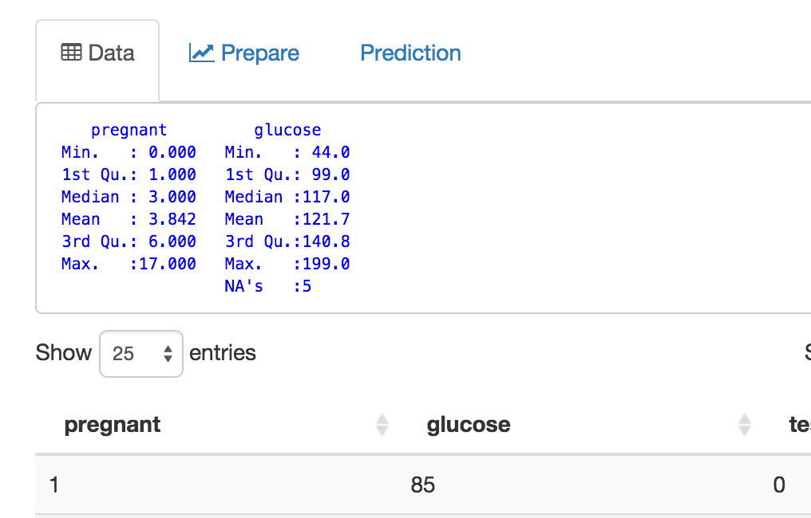
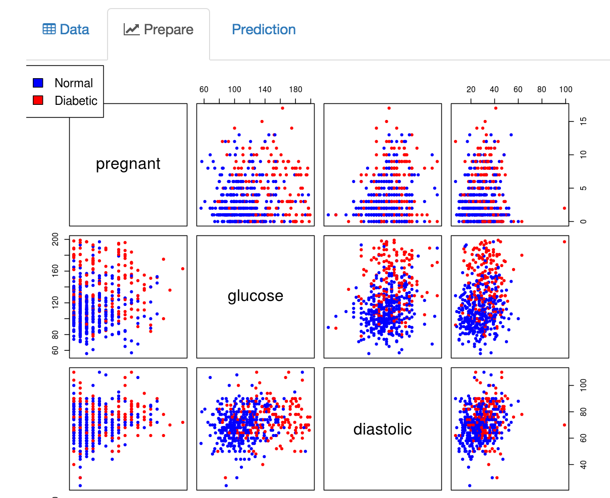
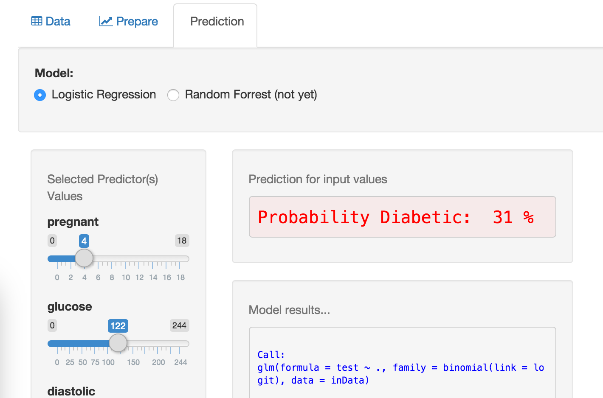

DiabetesDataExplorer
========================================================
author: Chenchals
date: December 12/27/15 2015
transition: rotate

<small>
Coursera Course: Data Science Specialization 
09-Developing Data Products
</small>

Diabetes Research
========================================================

Diabetes is a disease where patients have chronically high levels of _glucose_ in the blood.  This is primarily caused by the inability of __pancreas__ to produce _insulin_, a hormone that regulates the level of sugar in the blood.

The [Diabetes Data Explorer (DDE)](https://chenchalscoursera.shinyapps.io/DiabetesDataExplorer) helps to explore and model the various _predictors_. DDE can do model based prediction of the probability of disease for any arbitarary set of predictor values.

DDE currently uses data from the [UCI Machine Learning](https://archive.ics.uci.edu/ml/machine-learning-databases/pima-indians-diabetes/pima-indians-diabetes.names) repository on the prevelance of diabetes in Pima Indians.

Diabetes Data Explorer - Navbar
========================================================
 
***
__Predictors:__ Factors that affect the disease outcome. Choose two or more of these predictors to explore. 
__Select All Predictors:__ A one shot selection or de-selection of all _Predictors_ 
__Use Data:clean__ Removes rows, where the values of rthe _predictors_ are not sensible.  Example a _BMI_ of 0 
__Use Data:raw__ Use all rows, even if the value for a _predictor_ is not sensible

Diabetes Data Explorer - Explore & Analyze
========================================================

    
**Data Tab:  Explore selected predictor summary statistics**

**Prepare Tab: ** **Explore selected predictor interactions in scatterplots**

Diabetes Data Explorer - Prediction & Future
========================================================

**Prediction Tab:  Explore model prediction for arbitarary predictor values**
 
 
 
 

**Future** 
&nbsp;&nbsp;&nbsp;Prepare: Add correlations to the scatterplot using _ggpairs_ 
&nbsp;&nbsp;&nbsp;Prediction: Add different _models_, _learning algoriths_, _accuracy_, etc., 
**Bibliography** 
&nbsp;&nbsp;&nbsp;The DDE is mostly based on the [diabetes homework](http://www.stat.cmu.edu/~cshalizi/402/hw/07/solutions-07.pdf) of CMU.

